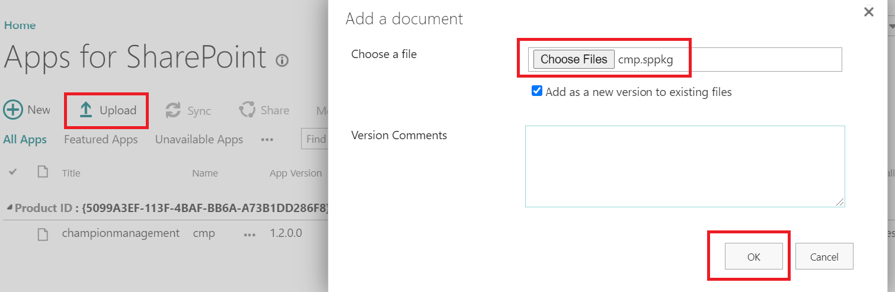
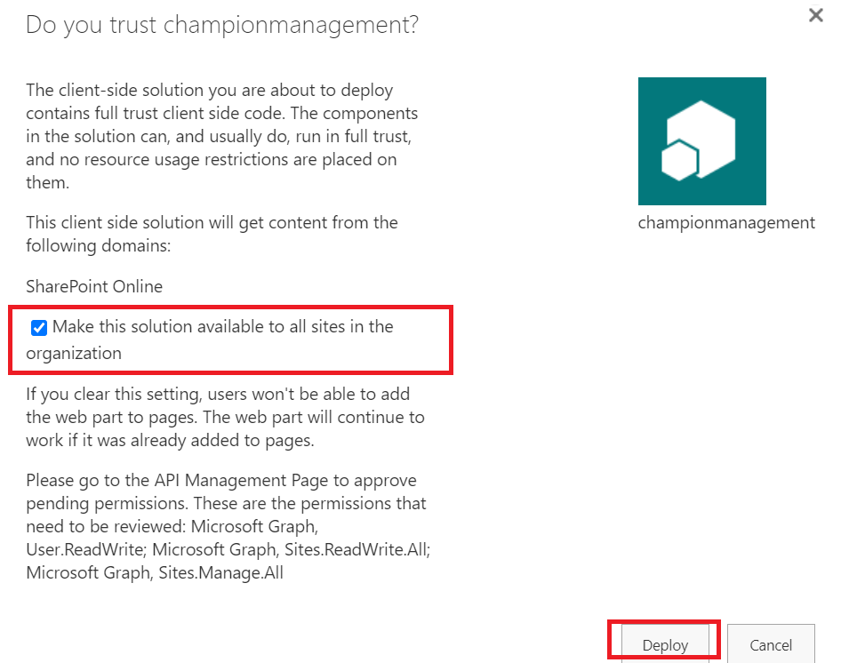
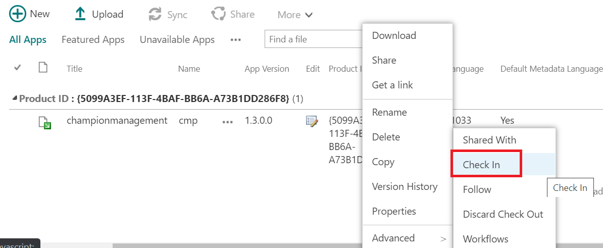
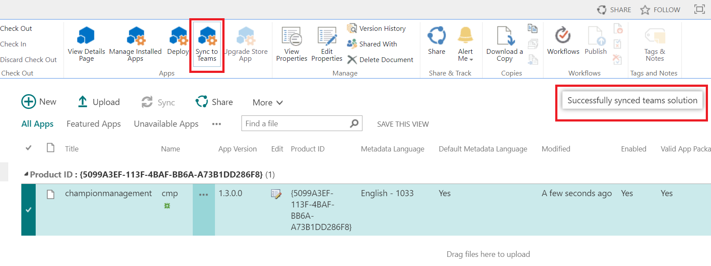
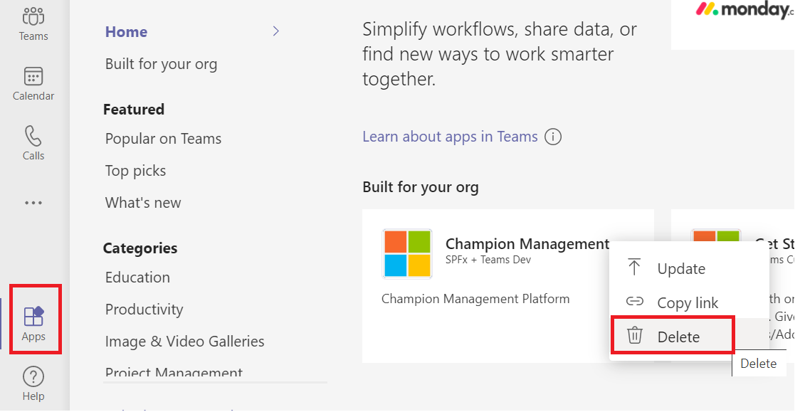
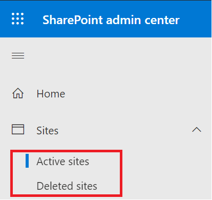

### Upgrade to version 1.3 from 1.2

If you are already having version 1.2 installed on your tenant follow the below steps to upgrade:

1.  Navigate to App Catalog with a tenant Admin account. Do not delete the existing 1.2 package. Upload the new package that is downloaded from "sharepoint/solution" folder which will replace the existing package.  

 

2. Click on "Deploy".

 

3. "Check In" the package.

 

4. Select the package and click "Sync to Teams" from the ribbon and wait for the "Successfully synced to teams solution" message to appear

 

5. The Champion Management Platform will be updated to the latest version and you will see changes reflected in Teams. Please note that if you do not see changes reflected in Teams after 30 minutes you can log out and back in and clear the Teams cache to see changes immediately. 

### Upgrade to version 1.3 from 1.1

If you are already having 1.1 installed on your tenant and want to upgrade to 1.3 the existing app and SharePoint site 'ChampionManagementSite' have to be deleted. 

If you have current members and events you will want to export those list items and import re-import them into the respective list areas. We have expanded our lists to have some additional data as well so you may need to populate additional fields. 

Memberlist (same information) 
EventList (same information) 
EventTrackDetails (added two colums to contain event name + member name) 

Follow the below steps to upgrade your install and optionally also export and import the data you may already have for the program. 

1.	Delete the existing App from Teams.
 

 

 
2.	Delete 'Members List' from root site.  
    a. Remember to export members if you are wanting to import the members back in 
3.	Delete 'ChampionManagementPlatform' Sharepoint site from both 'Active Sites' and 'Deleted Sites'.

    a. Remember to export the Event List and Event Track List if you are wanting to import the events details back in. 

 

 
 
4. Delete 'cmp.sppkg' from App Catalog.	
5. Startover the installation of new package following instructions from the section 'Standard Installation' of this document.
6. Once the install has completed and first run is done, you can visit the site assets of the ChampionManagementPlatform and import any of the exported Champion data